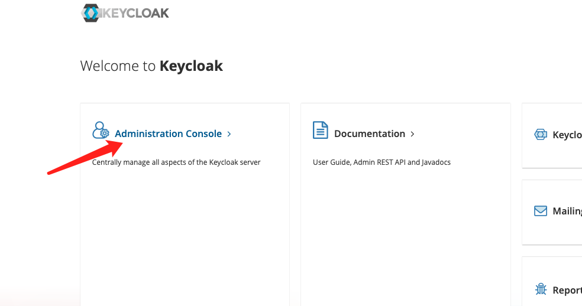
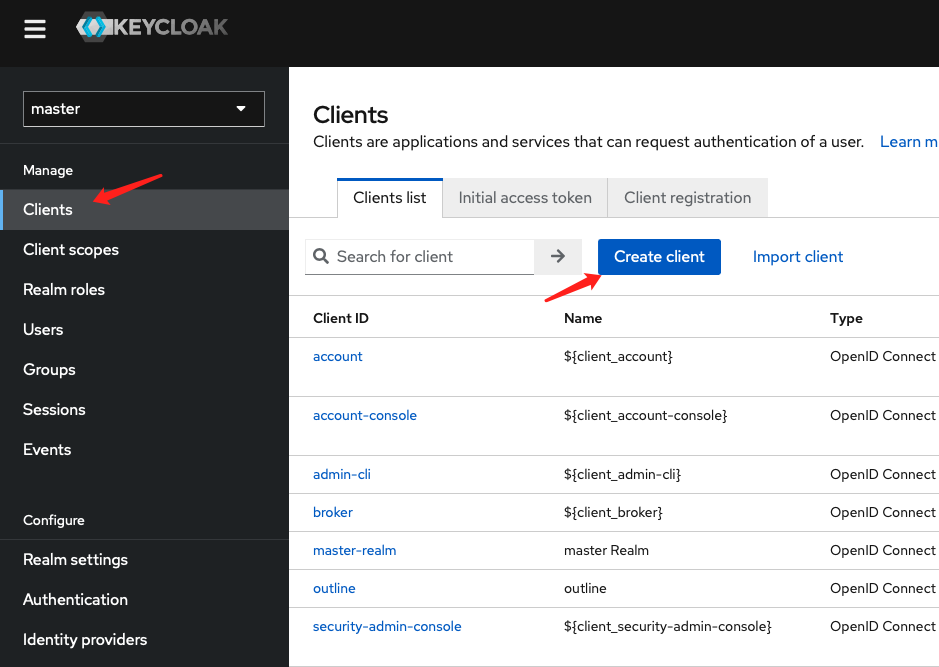
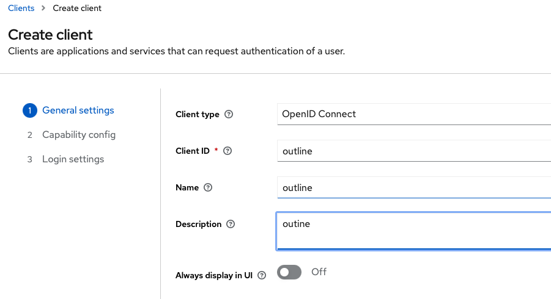
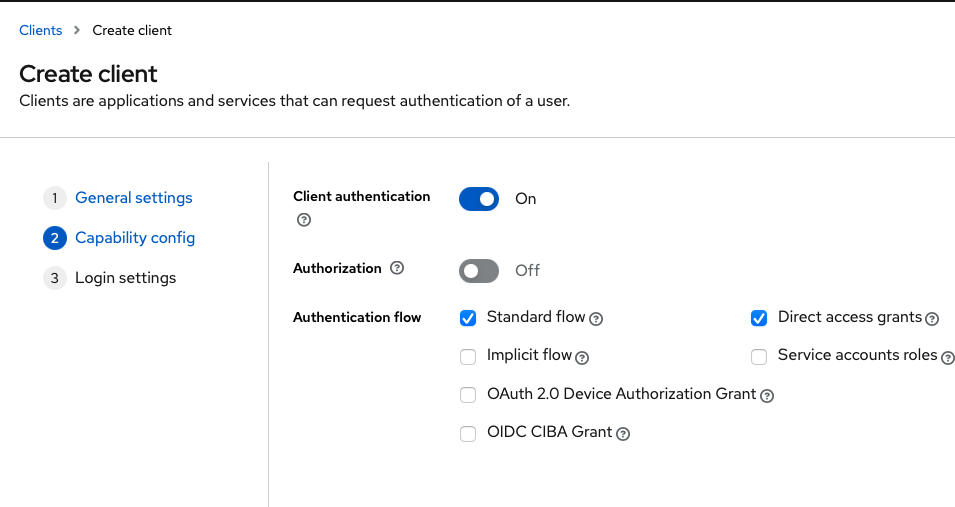
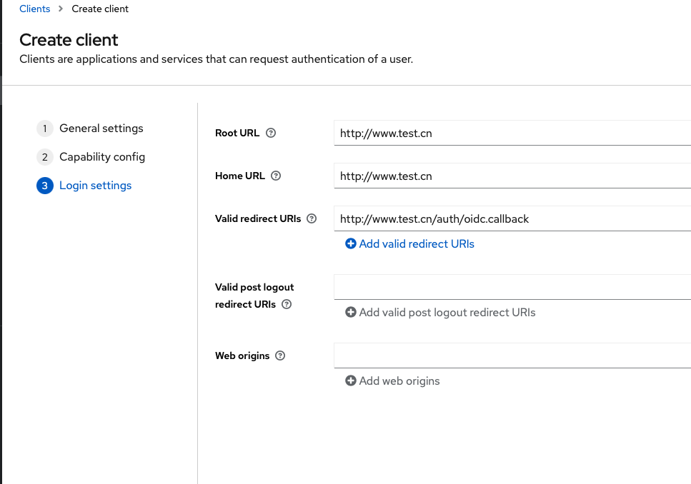
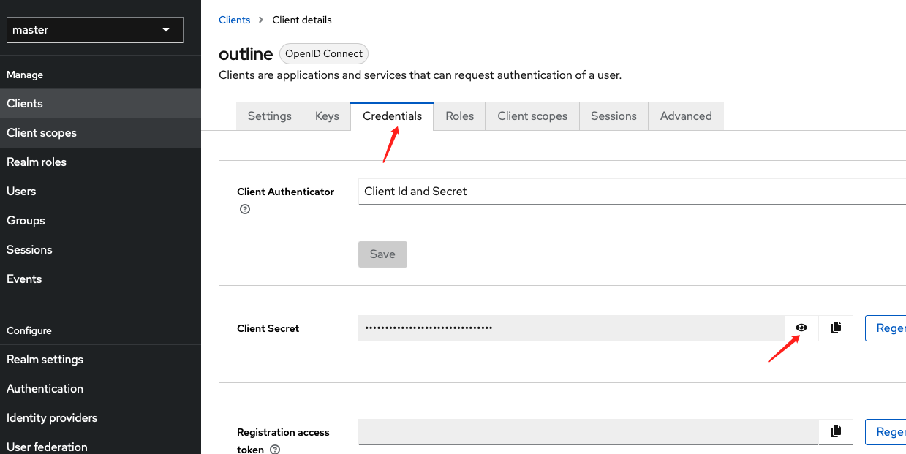
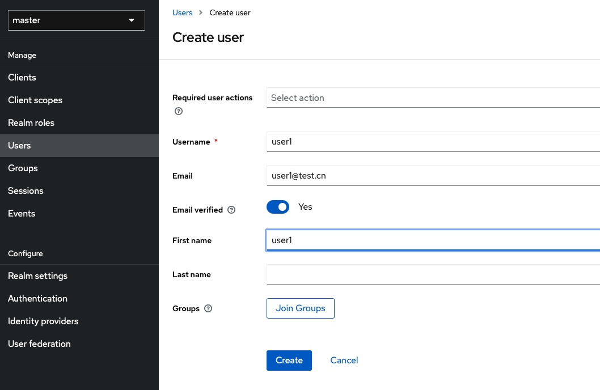
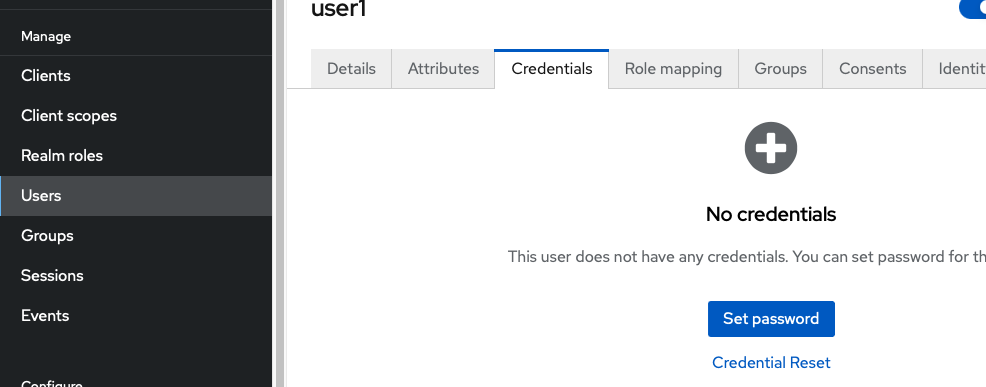
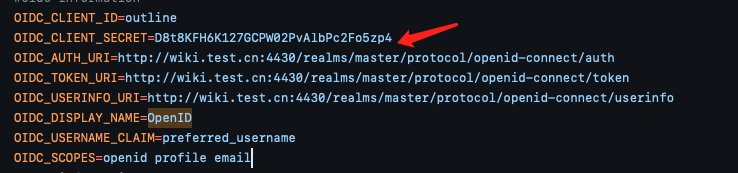

# docker-outline-keycloak
通过docker compose部署基本keycloak OIDC认证的outline服务

分二步部署
* 部署keycloak OIDC服务器
* 部署outline

# 1、keycloak OIDC部署
1.进入keycloak文件夹，替换docker-compose.yaml文件中域名www.test.cn自己的域名

2.执行docker compose up -d 运行keycloak

3.登录http://www.test.cn:4430/ ,进入administratoration Console

## 1.1 添加client

注意Valid redirect URIs 内容为`http://www.test.cn/auth/oidc.callback` 也可以写成`http://www.test.cn/*`

保存后进入outline 的Credentials 查看并记录下client Secret

## 1.2 添加用户
进入 Users-->Add user
注意需要填写好邮箱，否则outline无法登录。若需要二步验证可在Required user actions选择OTP

给用户添加密码

# 2、outline部署
## 配置修改
* 进入outline文件夹，修改.env文件，替换www.test.cn域名为你自己的域名
* 修改.env文件中OIDC信息
  
  

  替换OIDC_CLIENT_SECRET 为1.1中生成的client Secret

## 启动outline
执行 docker compose up -d
